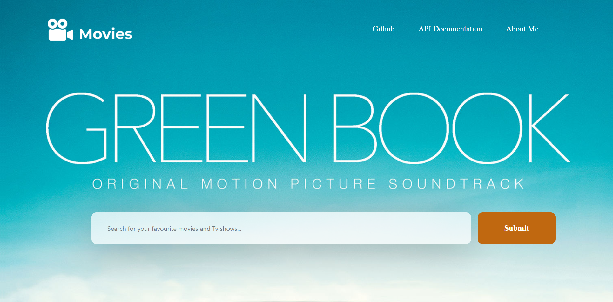

# Movies-Collection-Information-Website

The full guide on how to implement the Movie Database API can be found [Here](https://www.themoviedb.org/documentation/api)

The website looks like this:

# Example Project
See the Example Site for this Project ([Movies Collection Website](https://kapansa.github.io/)).

